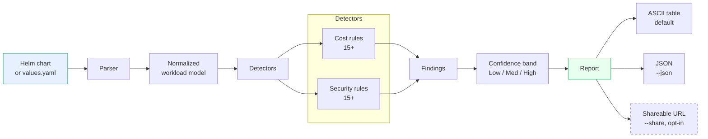
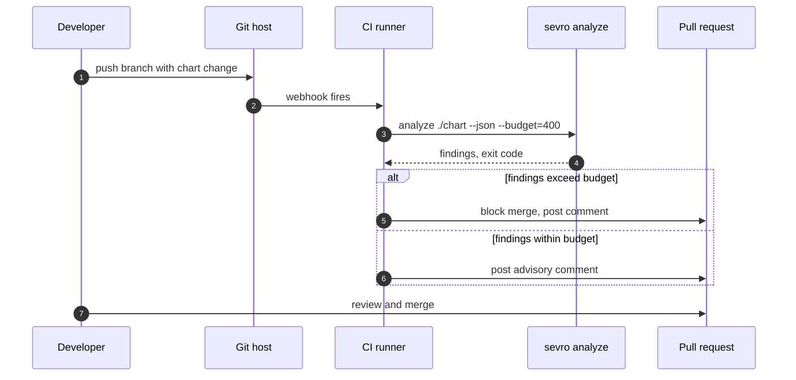
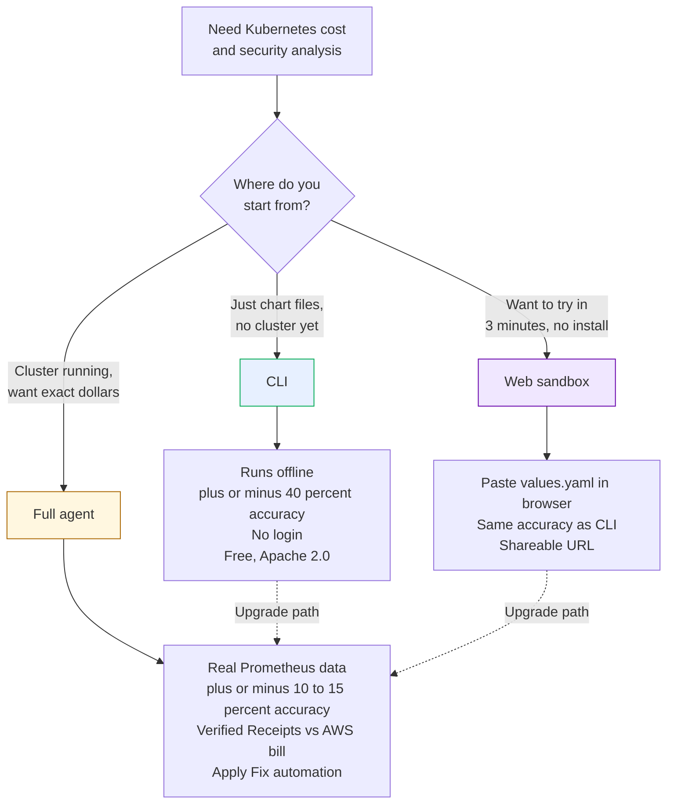

# Sevro

**Detect. Fix. Prove.**
Cost and security analysis for Kubernetes Helm charts, from your terminal. No login. No agent. No cluster connection required.

[](https://www.npmjs.com/package/@sevro/cli)
[](LICENSE)
[](https://pkg.go.dev/github.com/lowplane/sevro)
[](https://github.com/lowplane/sevro/actions/workflows/ci.yml)
[](https://www.npmjs.com/package/@sevro/cli)

```sh
npx @sevro/cli analyze ./my-helm-chart
```

That is it. One command. No setup. No account. Cost and security findings for your Kubernetes workloads in under three seconds.

---

## Table of Contents

- [Why Sevro CLI](#why-sevro-cli)
- [Install](#install)
- [Quick Start](#quick-start)
- [How It Works](#how-it-works)
- [Commands](#commands)
- [Example Output](#example-output)
- [CI/CD Integration](#cicd-integration)
- [CLI vs Agent vs Sandbox](#cli-vs-agent-vs-sandbox)
- [Configuration](#configuration)
- [Privacy and Accuracy](#privacy-and-accuracy)
- [The Full Sevro Platform](#the-full-sevro-platform)
- [FAQ](#faq)
- [Contributing](#contributing)
- [License](#license)

---

## Why Sevro CLI

Most Kubernetes cost tools require you to install an agent in your cluster, expose Prometheus, and wait 30 days for data. That is the right call for production teams who need exact numbers.

But sometimes you just want a directional answer **right now** about a chart you are reviewing.

The Sevro CLI is a deterministic rule engine that reads your Helm chart files (or `values.yaml`) and reports cost inefficiencies and security risks in seconds. It runs fully offline. It does not phone home. It is honest about what it can and cannot tell from static files alone.

> [!NOTE]
> The CLI gives you **directional signal**, not exact numbers. For exact dollar savings backed by 30 days of real Prometheus data and your AWS bill, install the [Sevro agent](https://sevro.dev/get) in your cluster.

---

## Install

### Option 1: npx (zero-install, recommended for one-off use)

```sh
npx @sevro/cli analyze ./chart
```

### Option 2: Global npm install

```sh
npm install -g @sevro/cli
sevro analyze ./chart
```

### Option 3: Go install

```sh
go install github.com/lowplane/sevro/cmd/sevro@latest
```

### Option 4: Download a release binary

Pre-built binaries for Linux (amd64, arm64) and macOS (amd64, arm64) are published on every tagged release.

```sh
# Linux amd64
curl -L https://github.com/lowplane/sevro/releases/latest/download/sevro_linux_amd64.tar.gz | tar -xz
sudo mv sevro /usr/local/bin/
```

> [!TIP]
> All release artifacts are signed with [Cosign](https://docs.sigstore.dev/cosign/overview/). Verification instructions on the [release page](https://github.com/lowplane/sevro/releases).

---

## Quick Start

```sh
# Run the bundled demo (no input needed)
npx @sevro/cli demo

# Analyze a chart directory
npx @sevro/cli analyze ./my-chart

# Analyze a single values file
npx @sevro/cli analyze ./values.production.yaml

# Compare two values files
npx @sevro/cli diff ./values.dev.yaml ./values.prod.yaml

# Score a chart against best practices (0-100)
npx @sevro/cli score ./my-chart

# Get JSON output for tooling
npx @sevro/cli analyze ./my-chart --json | jq '.findings[]'
```

---

## How It Works



The pipeline is deterministic. The same input always produces the same output. There are no LLM calls in the CLI itself; the LLM-driven Apply Fix flow lives in the SaaS backend.

---

## Commands

| Command | Purpose | Status |
| --- | --- | --- |
| `analyze [chart]` | Run full cost and security analysis on a chart or values file | Stable |
| `demo` | Run analysis on a bundled demo chart | Stable |
| `diff <a> <b>` | Show cost delta between two values files | Stable |
| `score [chart]` | Assign a 0–100 efficiency score with confidence band | Stable |
| `audit [chart]` | Security findings only (no cost detectors) | Stable |
| `compare <a> <b>` | Currently an alias for `diff` (richer output ships in Phase 7) | Beta |
| `watch [chart]` | Re-analyze on file change | Coming soon |
| `--version` | Print version and exit | Stable |
| `--help` | Help for any command | Stable |

### Filter and exit-code flags

| Flag | Effect |
| --- | --- |
| `--json` | Emit machine-readable JSON (every command) |
| `--no-color` / `NO_COLOR=1` | Disable ANSI output; auto-detected when piped |
| `--severity low\|med\|high` | Drop findings below the threshold (analyze) |
| `--detector <id>` | Repeatable allow-list, e.g. `--detector cpu-overprovisioned --detector image-pinned-latest` |
| `--fail-on low\|med\|high` | Exit code 1 if any finding meets/exceeds the severity (analyze, audit) |
| `--config <path>` | Load `.sevro.yaml` from a custom path (default `./.sevro.yaml` or `$SEVRO_CONFIG`) |

### Exit codes

| Code | Meaning |
| --- | --- |
| `0` | No findings at or above the threshold (or threshold unset) |
| `1` | Findings reported and `--fail-on` threshold met |
| `2` | Invocation error (bad path, malformed YAML, invalid flag) |
| `3` | Unexpected runtime error |

### Persistent config

A `.sevro.yaml` in the working directory (or pointed at via `--config` / `SEVRO_CONFIG`) lets you persist defaults:

```yaml
# .sevro.yaml
min_severity: med
fail_on: high
detectors:
  - cpu-overprovisioned
  - missing-memory-limit
  - image-pinned-latest
no_color: false
```

Flags always override config values when supplied.

---

## Example Output

```
$ npx @sevro/cli analyze ./charts/postgresql

Sevro Analysis ----------------------------------- sevro.dev
chart      bitnami/postgresql 12.5.7
namespace  database
context    static analysis from values.yaml

Cost findings (3)
  [HIGH]   Overprovisioned CPU request           save ~$340/mo   confidence: medium
           primary.resources.requests.cpu = 4    suggested: 1.5
           reason: 90th percentile sandbox baseline for similar charts

  [MED]    Persistent volume size oversized      save ~$80/mo    confidence: low
           primary.persistence.size = 100Gi      suggested: 30Gi
           reason: declared size 3x typical for this chart pattern

  [LOW]    No autoscaling configured             save ~$45/mo    confidence: low
           primary.replicaCount = 3 (static)
           reason: HPA could right-size off-hours

Security findings (2)
  [MED]    Missing memory limit on primary container
           risk: OOM noisy-neighbor; pod may be evicted under memory pressure
           CIS Kubernetes Benchmark 5.7.4

  [LOW]    Image tag is ":latest"
           risk: unreproducible deploys, no rollback target
           CIS Kubernetes Benchmark 5.5.1

Summary
  estimated monthly cost      $1,140
  estimated monthly savings   $465 (40 percent)
  efficiency score            58 / 100

Sandbox accuracy: plus or minus 40 percent. Install the Sevro agent for
exact numbers backed by 30 days of real Prometheus data and your AWS bill:
  https://sevro.dev/get

Share this analysis: https://sevro.dev/r/9f3a1c  (run with --share)
```

---

## CI/CD Integration

The CLI is designed to run inside a CI pipeline. Use exit codes to gate merges, or post the report as a PR comment.



### GitHub Actions

```yaml
name: Sevro
on:
  pull_request:
    paths: ["charts/**", "values/**"]

jobs:
  analyze:
    runs-on: ubuntu-latest
    steps:
      - uses: actions/checkout@v4
      - uses: actions/setup-node@v4
        with:
          node-version: "20"
      - name: Run Sevro
        run: npx @sevro/cli analyze ./charts/api --json > report.json
      - name: Comment on PR
        run: |
          npx @sevro/cli analyze ./charts/api \
            | gh pr comment ${{ github.event.pull_request.number }} --body-file -
        env:
          GH_TOKEN: ${{ secrets.GITHUB_TOKEN }}
```

### GitLab CI

```yaml
sevro:
  image: node:20-alpine
  rules:
    - if: $CI_PIPELINE_SOURCE == "merge_request_event"
      changes: [charts/**, values/**]
  script:
    - npx @sevro/cli analyze ./charts/api --json > report.json
  artifacts:
    paths: [report.json]
```

### pre-commit

```yaml
# .pre-commit-config.yaml
repos:
  - repo: local
    hooks:
      - id: sevro-analyze
        name: Sevro analyze
        entry: npx @sevro/cli analyze
        language: system
        files: '^charts/.*\.ya?ml$'
        pass_filenames: true
```

---

## CLI vs Agent vs Sandbox



| Surface | Accuracy | Setup | When to use |
| --- | --- | --- | --- |
| **Web sandbox** | plus or minus 40 percent | None, paste in browser | Curiosity, sharing a one-off finding |
| **CLI** (this repo) | plus or minus 40 percent | One npx command | PR review, CI gating, offline workflows |
| **Full agent + SaaS** | plus or minus 10 to 15 percent | Helm install, ~30 minutes | Production teams, paying customers, verified Receipts |

---

## Configuration

### Flags

| Flag | Default | Description |
| --- | --- | --- |
| `--json` | false | Emit machine-readable JSON |
| `--offline` | true | Do not perform any network calls |
| `--share` | false | Upload sanitized analysis to sevro.dev (opt-in) |
| `--no-color` | false | Disable ANSI color in output |
| `--quiet` | false | Suppress all output except findings |
| `--budget=<USD>` | unset | Exit non-zero if estimated savings exceed this dollar threshold |
| `--ignore=<rule-id,...>` | empty | Skip specific detector rules |
| `--namespace=<name>` | unset | Filter to a single namespace if the chart deploys to multiple |

### Environment Variables

| Variable | Purpose |
| --- | --- |
| `SEVRO_NO_COLOR` | Disable color output (CI-friendly, equivalent to `--no-color`) |
| `SEVRO_OFFLINE` | Force offline mode |
| `SEVRO_SHARE_BASE_URL` | Override the share endpoint (for self-hosted Sevro) |
| `SEVRO_SKIP_POSTINSTALL` | Skip the npm postinstall binary download (for offline npm caches) |

---

## Privacy and Accuracy

The CLI was designed to be unambiguously honest about its limitations. Three rules baked into the binary:

> [!IMPORTANT]
> **Accuracy is plus or minus 40 percent.** Every analysis output ends with a disclosure stating this. If you need exact numbers, you need real cluster metrics. The CLI deliberately cannot give you that.

> [!IMPORTANT]
> **No telemetry by default.** The CLI does not phone home. It does not collect usage statistics. It does not check for updates over the network unless you explicitly opt in.

> [!IMPORTANT]
> **`--share` is opt-in only.** When you pass `--share`, a sanitized version of your analysis is uploaded to `sevro.dev/r/<hash>` for sharing. Sanitization removes commit author emails, repo paths, and free-text comments. The unsanitized analysis is never sent anywhere.

If you want to verify any of these claims, the entire CLI is Apache 2.0 and lives in this repository. Read the source.

---

## The Full Sevro Platform

Sevro is a three-layer platform. This CLI is the open, free entry point to the first layer. The full platform binds all three with the same trust contract.

| Layer | Component | What it does |
| --- | --- | --- |
| 1. Detect | **Sevro Detect** | Cost + security analysis from real Prometheus data and Helm/Kustomize files. The CLI is the offline subset of this. |
| 2. Fix | **Sevro Apply** | One-click Apply Fix PRs with the exact Helm values diff, gated by `kubectl --dry-run=server` against your live cluster. |
| 3. Prove | **Sevro Prove** | Ed25519-signed Receipts of realized savings, verified against your AWS / Azure / Hetzner bill. Public, independently verifiable, transparency-logged. |

The CLI is free, open source, deliberately limited to plus or minus 40 percent accuracy because static files are all it sees. **The full platform turns the CLI's directional findings into exact dollar savings, automated PRs, and cryptographically verified Receipts against your actual cloud bill.**

```mermaid
flowchart LR
    PR[Helm or Kustomize PR] --> DETECT[Sevro Detect<br/>analysis under 30s]
    DETECT --> APPLY[Sevro Apply<br/>Apply Fix PR opens]
    APPLY --> MERGE[You merge]
    MERGE --> WATCH[7-day Auto-Rollback<br/>watchdog]
    WATCH --> MEASURE[Measure savings<br/>against cloud bill]
    MEASURE --> PROVE[Sevro Prove<br/>Ed25519 Receipt]
    PROVE --> SHARE[Share with finance,<br/>verify independently]

    style DETECT fill:#e7f0ff,stroke:#0a5
    style APPLY fill:#fff7e0,stroke:#a60
    style PROVE fill:#e8fff0,stroke:#0a5
```



### What you get when you install the agent

| Capability | CLI (this) | Full Platform |
| --- | --- | --- |
| Cost analysis from chart files | Yes | Yes, plus exact numbers from real Prometheus |
| Security findings on every PR | Yes (CI gate only) | Yes (PR comment, no CI setup needed) |
| **Apply Fix** — one-click PR with the exact Helm diff | No | Yes |
| **Verified Receipts** — Ed25519-signed proof of savings against your AWS bill | No | Yes |
| **Auto-Rollback Guarantee** — 7-day post-merge watchdog opens a rollback PR if metrics drift | No | Yes |
| **Cost Spike detection** — bill anomaly mapped back to the merged PR that caused it | No | Yes |
| Workload classification — bursty workers sized differently than steady web services | No | Yes |
| Cluster-aware sizing — Karpenter, Cluster Autoscaler, AKS, GKE, Hetzner | Static only | Yes, all five |
| GitHub + GitLab integration with @sevro thread Q&A | No | Yes |
| Operator-aware fixes — Prometheus Operator, Strimzi, cert-manager, Istio | No | Yes |
| Slack digest, customer dashboard, multi-cluster fleet view | No | Yes |
| SOC 2 Type 1, GDPR, EU data residency | n/a | Yes |

### How customers use it

> [!TIP]
> **Three-minute path:** paste your `values.yaml` at [sevro.dev/sandbox](https://sevro.dev/sandbox). No login. See what the SaaS would tell you, with the same plus-or-minus-40-percent disclosure as this CLI.

> [!TIP]
> **Ten-minute path:** install the GitHub or GitLab App. The next PR you open against any Helm chart in the connected repo gets a Sevro comment with cost and security findings. Still sandbox accuracy until you install the agent.

> [!TIP]
> **Thirty-minute path:** `helm install sevro-agent` in your cluster. Within 30 days you receive your first signed Receipt proving exact dollar savings against your AWS, Azure, or Hetzner bill.

### Pricing

| Plan | Price | What is included |
| --- | --- | --- |
| **Free** | $0 forever | 2 clusters, one verified Receipt per month, all detectors |
| **Team** | $500 / month | 5 clusters, unlimited Receipts, Slack digest, dashboard |
| **Enterprise** | Custom | Unlimited clusters, dedicated CSM, SLA, in-VPC option, EU residency |

Ship with confidence: every recommendation is paired with a Confidence band, every Apply Fix is gated by `kubectl --dry-run=server` against your live cluster, every merged change is watched for 7 days, and every claimed dollar of savings is signed against the real cloud bill.

[**Try the sandbox**](https://sevro.dev/sandbox) - [**Install the agent**](https://sevro.dev/get) - [**Book a demo**](https://sevro.dev/demo) - [**Read the architecture**](https://sevro.dev/how-it-works)

---

## FAQ

<details>
<summary><b>Why is the CLI rule-based instead of LLM-driven?</b></summary>

Determinism. The same chart should produce the same findings every time. LLMs are non-deterministic and would make CI gating unreliable. The LLM-driven Apply Fix flow lives in the [Sevro SaaS](https://sevro.dev) where every recommendation is paired with measured outcomes via Verified Receipts.

</details>

<details>
<summary><b>Does this work on my Kustomize / ArgoCD / Flux setup?</b></summary>

Yes for any setup that produces Helm-renderable YAML. The CLI parses the rendered output, not the source format. ArgoCD `Application` manifests with Helm sources work directly. Flux `HelmRelease` resources work directly. Kustomize overlays work after `kustomize build`.

</details>

<details>
<summary><b>What about my Hetzner / on-prem / AKS / GKE cluster?</b></summary>

The CLI is cluster-agnostic. It reads chart files; it does not care where the cluster runs. Note that **dollar estimates** in the output assume AWS pricing today. EUR-denominated estimates for Hetzner customers ship in Q3 2026 alongside the EU GA of the SaaS.

</details>

<details>
<summary><b>How do I extend it with my own detectors?</b></summary>

The detector SDK is in development for Q4 2026. Until then, the easiest path is to fork this repo and add a detector in `internal/rules/`. PRs adding genuinely useful new detectors are welcome — see [CONTRIBUTING.md](CONTRIBUTING.md).

</details>

<details>
<summary><b>Is this a Kubecost competitor?</b></summary>

No. Kubecost is a cluster-installed cost dashboard. We are a static-analysis CLI plus a PR-layer SaaS. Many Sevro users also run Kubecost for their dashboard view; the products are complementary.

</details>

<details>
<summary><b>How do I report a security issue?</b></summary>

See [SECURITY.md](SECURITY.md). Email `security@sevro.dev`. Do not open public GitHub issues for security bugs.

</details>

---

## Contributing

Contributions are welcome. See [CONTRIBUTING.md](CONTRIBUTING.md) for the full guide. Highlights:

- All commits use [Conventional Commits](https://www.conventionalcommits.org/) (`feat(parser): support kustomize overlays`)
- All commits require DCO sign-off (`git commit -s`)
- Behavior changes need a golden test in `testdata/fixtures/`
- No LLM calls, no telemetry, no Windows-specific code paths (these are project-defining constraints)
- See [CODE_OF_CONDUCT.md](CODE_OF_CONDUCT.md)

Good first issues are labeled [`good-first-issue`](https://github.com/lowplane/sevro/labels/good-first-issue).

---

## Community

- **Discussions** — [github.com/lowplane/sevro/discussions](https://github.com/lowplane/sevro/discussions)
- **Issues** — [github.com/lowplane/sevro/issues](https://github.com/lowplane/sevro/issues)
- **Security** — `security@sevro.dev` (see [SECURITY.md](SECURITY.md))
- **General** — [`hello@sevro.dev`](mailto:hello@sevro.dev)

---

## About the name

Sevro is a backronym for the three things every Kubernetes change needs and that nobody currently provides as one platform:

- **S**avings
- **E**vidence
- **R**emediation **O**ps

Detect waste, fix it, prove it. The product architecture, restated as the brand.

---

## License

Apache License 2.0. See [LICENSE](LICENSE).

> [!NOTE]
> The CLI is the only part of Sevro that is open source. The SaaS backend, in-cluster agent, and Apply Fix infrastructure are proprietary. The CLI is independently buildable, independently auditable, and independently licensable; it never imports proprietary code.

---

<sub>Sevro is a product of Sevro, Inc. Trademark and brand assets are not licensed under Apache 2.0.</sub>
